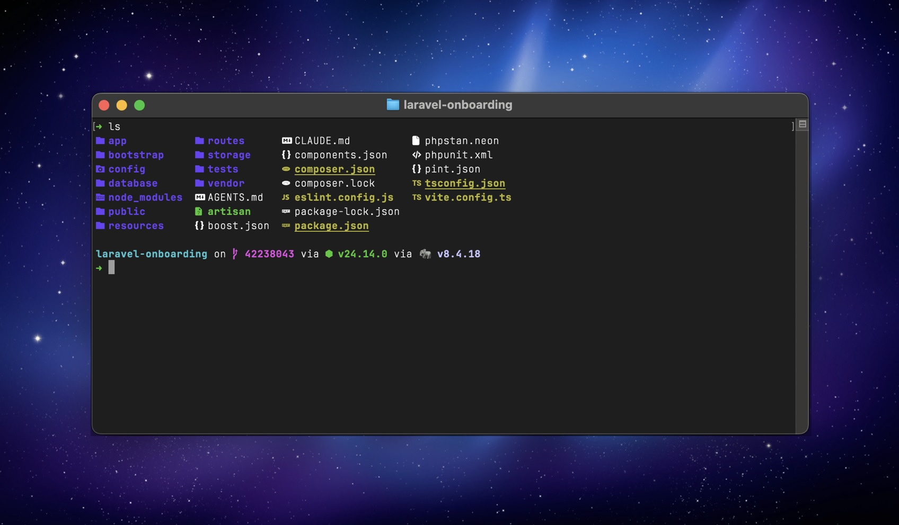

# My dotfiles



[](https://skills.sh/PickleBoxer/dotfiles)

Personal dotfiles with modern shell tooling, optimized for Laravel/PHP development. Features fast startup times, smart directory navigation, and modern CLI tools.

## Contents

**Getting started**

- [Key Features](#key-features)
- [Quick Start](#quick-start) - SSH key, then clone and run `bin/install`
- [What's Included](#whats-included) - [Shell & Prompt](#shell--prompt) · [Modern CLI Tools](#modern-cli-tools) · [Development Tools](#development-tools) · [QuickLook Plugins](#quicklook-plugins)

**Reference**

- [How It Works](#how-it-works) - [Symlinked Files](#symlinked-files) · [Sourced Files](#sourced-files) · [Starship Prompt](#starship-prompt) · [Conductor Terminal Support](#conductor-terminal-support)
- [Daily Usage](#daily-usage) - [Smart Navigation](#smart-navigation) · [Laravel/PHP Shortcuts](#laravelphp-shortcuts) · [Data Processing](#data-processing) · [Maintenance Commands](#maintenance-commands) · [Syncing Changes from Upstream](#syncing-changes-from-upstream-freekmurzedotfiles)
- [Version Management](#version-management) - [Node.js via fnm](#nodejs-via-fnm) · [PHP & Composer via Homebrew](#php--composer-via-homebrew) · [DDEV vs Valet](#local-development-ddev-vs-valet)
- [Package Management](#package-management) - the Brewfile and global npm and Composer packages
- [DDEV SSH Commit Signing](#ddev-ssh-commit-signing)

**AI setup**

- [Claude Code Integration](#claude-code-integration) - one config for Claude Code and Codex
  - [Quick Install (Standalone)](#quick-install-standalone) - the AI setup without the rest of the dotfiles
  - [Skills](#skills-version-controlled) - grouped by purpose
  - [Adding New Skills](#adding-new-skills)
  - [Settings](#settings-configclaudesettingsjson) - including per-project scoping
  - [Agents](#agents-version-controlled) - custom subagents
  - [Code Intelligence](#code-intelligence) - Laravel LSP, Intelephense, TypeScript
  - [The Review Workflow](#the-review-workflow) - the six lanes behind `review-code` and `review-pr`
  - [Sharing With Codex](#sharing-with-codex) - how one source feeds both harnesses

**Everything else**

- [Customization](#customization) - [Personal Aliases & Functions](#personal-aliases--functions) · [Project-Specific Variables](#project-specific-variables)
- [Post-Installation](#post-installation) · [Tool Comparisons](#tool-comparisons) · [Utilities](#utilities) · [Credits](#credits)

---

## Key Features

- **Starship Prompt** - Fast, cross-shell prompt with Powerline style (configured via `config/starship.toml`)
- **Version-Controlled Skills & Agents** - All Claude Code skills and agents synced via dotfiles
- **Fast Tools** - fnm, zoxide, ripgrep, bat, eza (all Rust-based for speed)
- **Nerd Fonts** - Installed automatically via Brewfile for perfect icon support
- **One Command Install** - `bin/install` sets up everything including Claude Code

---

## Quick Start

### 1. SSH Key (if you don't have one yet)

```bash
curl -fsSL https://raw.githubusercontent.com/PickleBoxer/dotfiles/main/ssh.sh | sh -s your@email.com
```

This generates an `ed25519` SSH key, configures `~/.ssh/config`, adds it to the keychain, and copies the public key to your clipboard so you can paste it into [GitHub SSH settings](https://github.com/settings/ssh/new).

### 2. Install dotfiles

```bash
git clone git@github.com:PickleBoxer/dotfiles.git ~/.dotfiles
cd ~/.dotfiles
bin/install
```

---

## What's Included

### Shell & Prompt

- **Starship** - Fast, minimal cross-shell prompt (replaces Oh My Zsh)
- **zoxide** - Smart directory jumping based on frecency
- **fzf** - Fuzzy finder for files and history
- **direnv** - Automatic environment variables per directory

### Modern CLI Tools

- **fnm** - Fast Node.js version manager
- **bat** - Cat with syntax highlighting
- **eza** - Modern ls replacement with icons
- **ripgrep** - Fast grep alternative
- **fd** - Fast find alternative
- **git-delta** - Better git diffs
- **jq** - JSON processor and formatter
- **yq** - YAML processor and formatter
- **bottom** - Modern system monitor

### Development Tools

- **PHP** - Latest version via Homebrew
- **Composer** - Dependency manager via Homebrew
- **Node.js** - LTS version managed via fnm
- **DDEV** - Local development environment (Docker-based, used for all projects)
- **Laravel Valet** - Lightweight alternative for local development (optional, see below)

### QuickLook Plugins

Instant file previews in Finder: code files, markdown, JSON, CSV, patches, and archives.

---

## How It Works

### Symlinked Files

The installation creates symlinks from your home directory to the dotfiles repository. This allows you to version control your configuration while keeping files in their expected locations.

| Symlink Location                      | Points To                                             | Purpose                                                |
| ------------------------------------- | ----------------------------------------------------- | ------------------------------------------------------ |
| `~/.zshrc`                            | `~/.dotfiles/home/.zshrc`                             | Main Zsh configuration (Starship prompt, no Oh My Zsh) |
| `~/.gitconfig`                        | `~/.dotfiles/home/.gitconfig`                         | Git configuration with delta diff viewer               |
| `~/.global-gitignore`                 | `~/.dotfiles/home/.global-gitignore`                  | Global Git ignore patterns                             |
| `~/.mackup.cfg`                       | `~/.dotfiles/macos/.mackup.cfg`                       | Mackup backup configuration                            |
| `~/.claude/skills`                    | `~/.dotfiles/config/claude/skills/`                   | All Claude Code skills (version-controlled)            |
| `~/.claude/agents`                    | `~/.dotfiles/config/claude/agents/`                   | All Claude Code agents (version-controlled)            |
| `~/.claude/rules`                     | `~/.dotfiles/config/claude/rules/`                    | All Claude Code rules (version-controlled)            |
| `~/.claude/CLAUDE.md`                 | `~/.dotfiles/config/claude/AGENTS.md`                 | Claude Code configuration (shared with Codex as AGENTS.md) |
| `~/.claude/settings.json`             | `~/.dotfiles/config/claude/settings.json`             | Claude Code settings                                   |

### Sourced Files

These files are loaded by `.zshrc` but remain in the dotfiles directory:

- `home/.aliases` - Shell command aliases
- `home/.functions` - Custom shell functions
- `home/.exports` - Environment variables

### Starship Prompt

The prompt is configured in `config/starship.toml` and uses a Powerline-style agnoster look:

**Features:**

- Powerline arrows for segment separators
- Git branch and status indicators
- Error color on non-zero exit codes
- Requires Nerd Font with powerline glyphs

**Git Status Symbols:**

- `!` - Modified files
- `+` - Staged changes
- `?` - Untracked files
- `✘` - Conflicted files

### Conductor Terminal Support

Conductor's built-in terminal can't render Nerd Font icons or powerline separators. `.zshrc` and `.aliases` detect it automatically (`$__CFBundleIdentifier` / `$CONDUCTOR_INTERNAL_BIN_DIR`) and fall back to plain-text equivalents:

| Context                               | Starship config               | `eza` icons |
| -------------------------------------- | ------------------------------ | ----------- |
| Normal terminal (Ghostty, iTerm, ...)  | `config/starship.toml`         | enabled     |
| Conductor's terminal                   | `config/starship-plain.toml`   | disabled    |

No manual switching needed, it's automatic per-session.

---

## Daily Usage

### Smart Navigation

```bash
z dotfiles          # Jump to frequently used directories
zi                  # Interactive directory picker
Ctrl+R              # Fuzzy search command history
Ctrl+T              # Fuzzy find files
Alt+C               # Fuzzy change directory
```

### Laravel/PHP Shortcuts

```bash
a                   # php artisan
p                   # Run Pest/PHPUnit tests
c                   # composer
mfs                 # php artisan migrate:fresh --seed
nah                 # git reset --hard; git clean -df
```

### Data Processing

```bash
# JSON processing with jq
curl api.github.com/users/PickleBoxer | jq
cat composer.json | jq '.require'
php artisan tinker --execute="echo json_encode(User::first());" | jq

# YAML processing with yq
yq '.jobs' .github/workflows/ci.yml
yq -o json docker-compose.yml

# System monitoring
btm                 # Modern system monitor (aliased from top/htop)
```

### Maintenance Commands

```bash
bin/update          # Update all packages and tools
```

### Syncing Changes from Upstream (freekmurze/dotfiles)

This repo is forked from [freekmurze/dotfiles](https://github.com/freekmurze/dotfiles). To check and selectively apply upstream changes:

**1. Check what is new:**

```bash
cd ~/.dotfiles
git fetch upstream
git log upstream-synced..upstream/main --format="%h %ci %s"
```

Empty output means you are fully up to date.

**2. Inspect a specific commit:**

```bash
git show <commit-hash> --stat
```

**3. Cherry-pick files you want from upstream:**

```bash
git checkout upstream/main -- path/to/file-or-folder
```

**4. Mark as synced after applying changes:**

```bash
git tag -f upstream-synced upstream/main
```

---

## Version Management

### Node.js (via fnm)

```bash
fnm install --lts     # Install latest LTS
fnm use lts-latest    # Use latest LTS
fnm install 20        # Install specific version
fnm use 20            # Switch to specific version
fnm list              # Show installed versions
```

### PHP & Composer (via Homebrew)

```bash
brew upgrade php      # Update PHP to latest
brew upgrade composer # Update Composer
```

### Local Development: DDEV vs Valet

This setup uses **DDEV** (Docker-based) as the primary local development environment. It manages PHP versions, databases, and services per-project with zero global config.

**Laravel Valet** is available as a lightweight alternative: faster to start, no Docker required, but shares a single global PHP version. To install:

```bash
composer global require laravel/valet
valet install
```

Both can coexist. DDEV is preferred for projects that need specific PHP versions or services (MySQL, Redis, etc.).

---

## Package Management

All Homebrew packages are declared in `config/Brewfile`. To add a new tool:

```bash
echo 'brew "tree"' >> ~/.dotfiles/config/Brewfile
brew bundle --file=~/.dotfiles/config/Brewfile
```

**Complete package list:**

- **Core**: node, php, php@8.4, composer, pkgconf, wget, ncdu, hub, gh, ack, doctl, 1password-cli, git-secret, imagemagick, yarn, ghostscript, mackup, mkcert, bun
- **Local dev**: ddev, phpmon
- **Apps**: raycast, ghostty, rectangle, google-chrome, slack, tableplus, visual-studio-code, dbngin, github, httpie-desktop, imageoptim, tinkerwell, the-unarchiver, vlc
- **Modern CLI**: starship, zoxide, bat, eza, ripgrep, fd, git-delta, fnm, fzf, direnv, jq, yq, bottom, mas, tree, trash, uv, coreutils, gnu-sed, bash
- **Zsh**: zsh-autosuggestions, zsh-syntax-highlighting
- **Fonts**: font-meslo-lg-nerd-font, font-jetbrains-mono, font-jetbrains-mono-nerd-font, font-fira-code, font-fira-code-nerd-font, font-open-sans, font-roboto, font-bitter, font-lato
- **QuickLook**: qlmarkdown, betterzip, suspicious-package
- **PHP Extensions** (optional, via `bin/install` prompt): imagick, memcached, xdebug, redis
- **Global Composer** (optional, via `bin/install` prompt): laravel/pint, laravel/envoy, laravel/installer, spatie/phpunit-watcher

---

## DDEV SSH Commit Signing

The install script automatically sets up one-time host configuration so all DDEV containers inherit your git identity and SSH commit signing:

- Symlinks `~/.gitconfig` into `~/.ddev/homeadditions/` so every container picks up your signing config
- Symlinks `~/.ssh/id_ed25519.pub` into the container's `~/.ssh/` (git needs the public key file present)
- Adds your SSH key to the host agent

After each reboot, run once to forward the agent into containers:

```bash
ddev auth ssh
```

If you also need custom SSH host entries inside containers (e.g. a self-hosted GitLab), add them to `~/.ddev/homeadditions/.ssh/config.d/custom.conf`.

---

## Claude Code Integration

### Quick Install (Standalone)

Install just Claude Code without the full dotfiles:

```bash
curl -fsSL https://raw.githubusercontent.com/PickleBoxer/dotfiles/main/bin/install-claude-code | bash
```

### What's Included

- **Claude Code CLI** - Installed via Homebrew
- **Custom configuration** - CLAUDE.md with coding guidelines (shared with Codex as AGENTS.md)
- **Version-controlled skills** - Entire `~/.claude/skills` directory symlinked to dotfiles
- **Version-controlled agents** - Entire `~/.claude/agents` directory symlinked to dotfiles

### Skills (Version Controlled)

All skills are stored in `config/claude/skills/` and version-controlled with your dotfiles. When you run the installer on a new Mac, all skills are immediately available.

**Laravel / PHP:**

- `spatie-guidelines` - Spatie's PHP, Laravel, JS, and Vue coding conventions
- `spatie-package-skeleton` - Scaffold Spatie-style PHP/Laravel packages
- `laravel-lsp` - Wires Laravel's language server into Claude Code (route names, config keys, view paths)
- `laravel-inertia-react-structure` - Spatie's frontend structure conventions for Laravel Inertia + React
- `livewire-4` - Build Livewire 4 components and applications
- `speeding-up-laravel-tests` - Diagnose and fix slow Laravel/Pest test suites

**Code quality / review:**

- `audit-architecture` - Read-only, multi-agent architecture audit (data structures, state, control flow)
- `audit-codebase` - Read-only codebase-wide simplification audit
- `refactor` - Surgical refactoring without behavior change
- `refactor-plan` - Plan a multi-file refactor before executing it
- `review-code` - Review changed code against project conventions
- `review-pr` - Review and merge GitHub PRs for Spatie packages
- `explain-changes` - Explain a branch's changes as an HTML walkthrough

**Frontend:**

- `frontend-design` - Distinctive, intentional visual/UI design guidance
- `web-design-guidelines` - Review UI code against Web Interface Guidelines
- `vercel-react-best-practices` - React/Next.js performance patterns from Vercel Engineering
- `typescript-advanced-types` - Advanced TypeScript type system patterns

**Tools & integrations:**

- `chrome-devtools` - Browser automation/debugging via Chrome DevTools MCP
- `conductor` - Manage Conductor.build parallel-agent workspaces and sessions
- `sentry-cli` - Sentry CLI for issues, events, and projects
- `mailcoach` - Manage Mailcoach email marketing via CLI
- `code-snippet-images` - Generate code screenshot images for social/docs
- `find-skills` - Discover and install new agent skills

**Marketing** (bundled plugin, `config/claude/skills/marketing/`, disabled by default):

- ~25 sub-skills covering CRO, SEO, ads, copywriting, pricing, onboarding, and more for Spatie product sites

### Adding New Skills

```bash
# Install a new skill (adds directly to your dotfiles)
npx skills add <owner/repo>

# Commit to version control
cd ~/.dotfiles
git add config/claude/skills/
git commit -m "Add new skill"
git push
```

Browse more skills at [skills.sh](https://skills.sh)

### Settings (`config/claude/settings.json`)

Symlinked to `~/.claude/settings.json`, so every project on this machine shares the same base config. Notable pieces:

- **`permissions`** - `allow`/`deny`/`ask` lists for tools and Bash commands, plus `defaultMode: auto`. The `deny` list blocks risky actions outright (e.g. `git commit`, `ExitPlanMode`); `ask` prompts before reading sensitive paths (`~/.ssh`, `.env` files).
- **`enabledPlugins`** - toggles whole bundled plugins (e.g. `php-lsp`, `typescript-lsp`, `mattpocock-skills`) on/off globally.
- **`skillOverrides`** - per-skill visibility for loose (non-plugin) skills. Values: `"on"` (default), `"name-only"`, `"user-invocable-only"`, or `"off"`. Used here to keep utility skills like `simplify`/`run`/`init` invocable only via explicit command, not auto-triggered.
- **`autoMode`** - environment context (org, cloud provider, trusted domains, sensitive paths) that auto mode uses to judge which actions need confirmation. This is machine/project-specific, not something to copy between repos.
- **`effortLevel`**, **`fastMode`**, **`spinnerVerbs`**, **`cleanupPeriodDays`** - misc behavior tuning.

#### Scoping skills/plugins per project

Both `enabledPlugins` and `skillOverrides` work the same way in **any** settings file Claude Code reads, not just the global one:

| Scope | File | Applies to |
| ----- | ---- | ---------- |
| User (this machine, all projects) | `~/.claude/settings.json` | everything, unless overridden below |
| Shared project (committed, everyone who clones the repo) | `<repo>/.claude/settings.json` | just that repo |
| Local project (this machine, this repo only, gitignored) | `<repo>/.claude/settings.local.json` | just that repo, just you |

Settings from these files merge (project-level list entries add to user-level ones rather than replacing them). So a specific repo can disable a globally-available skill, or turn on a plugin that's off everywhere else, without touching this dotfiles repo at all:

```json
// <some-repo>/.claude/settings.json
{
  "skillOverrides": {
    "sentry-cli": "off"
  },
  "enabledPlugins": {
    "swift-architecture-skill@swift-architecture-skill": true
  }
}
```

That's the real pattern used for the Swift plugins registered in `extraKnownMarketplaces` (`swift-architecture-skill`, `swift-concurrency-agent-skill`, `swiftui-agent-skill`, `swift-testing-agent-skill`): they stay off in `enabledPlugins` globally, and get turned on per repo where they're actually relevant.

`skillOverrides` only affects loose skills (the ones directly under `config/claude/skills/`, like `sentry-cli` or `conductor`). Plugin-bundled skills (like `marketing`, which ships its own `.claude-plugin/plugin.json`) are controlled via `enabledPlugins` instead, `skillOverrides` doesn't apply to them.

### Agents (Version Controlled)

All custom agents are stored in `config/claude/agents/` and version-controlled with your dotfiles. When you run the installer on a new Mac, all agents are immediately available.

**Custom Agents:**

- `laravel-feature-builder` - Implements new features in Laravel applications (models, controllers, migrations, routes, views)

Most PHP simplification now happens through the `laravel-simplifier:laravel-simplifier` agent, from the `laravel@laravel` plugin marketplace enabled in `enabledPlugins`, rather than a custom agent in this repo. It's lane 2 of the review workflow below.

### Code Intelligence

Three language servers give the agent diagnostics after every edit and real symbol navigation instead of grep.

| Server | Provides | Install |
| --- | --- | --- |
| `laravel-lsp@skills-dir` | Route names, view paths, translation strings, middleware aliases, and container bindings, in `.blade.php` | `composer global require laravel/lsp` |
| `php-lsp` | PHP types, symbols, references, signatures | `npm i -g intelephense` |
| `typescript-lsp` | TypeScript and TSX intelligence | `npm i -g typescript-language-server typescript` |

Claude Code registers one server per file extension, so the two PHP servers split the work: Intelephense takes `.php` for types, undefined methods, and references, and Laravel LSP takes `.blade.php` for route names, view paths, and translation strings.

### The Review Workflow

`review-code` and `review-pr` share one definition of what a review is, in `skills/review-code/references/lanes.md`. Six lanes run in parallel:

1. **Correctness** - bugs, via `/code-review`
2. **PHP simplification** - via the `laravel-simplifier` agent
3. **Spatie conventions** - via `spatie-guidelines`
4. **Laravel practices** - via Laravel Boost's per-repo `laravel-best-practices`
5. **React** - via `vercel-react-best-practices`, only when JS or TS changed
6. **Security** - authorization, mass assignment, injection, XSS, secrets, SSRF, PII in logs

Findings are deduplicated, and security outranks correctness, which outranks conventions. Both defect lanes require a concrete failure scenario, so "consider adding a null check" does not count as a finding.

The lanes file has a per-harness table, so the same review runs under Codex with its own tools and available subagents.

### Sharing With Codex

Codex reads `AGENTS.md` natively and Claude Code reads `CLAUDE.md`, so one file is symlinked under both names. Skills also have one source: `config/claude/skills/`. Claude reads it through `~/.claude/skills`; Codex reads individual symlinks in `~/.agents/skills`, its documented user skill directory.

```bash
bin/install-agent-skill-sync
```

The script links every directory with a top-level `SKILL.md` and installs a per-user macOS LaunchAgent (`dev.maticvertacnik.agent-skill-sync`) so no manual command is needed when adding skills. It runs at login, watches the source directory, and checks every 60 seconds for changes inside existing folders. Removed or renamed skills have their old managed links cleaned up. `bin/install-claude-code` installs this job automatically on new machines.

To run a check immediately without waiting on the background job, use `bin/link-agent-skills`. Background errors go to `~/Library/Logs/dev.maticvertacnik.agent-skill-sync.log`.

---

## Customization

### Personal Aliases & Functions

Create custom configurations that won't be committed:

```bash
mkdir -p ~/.dotfiles-custom/shell
vim ~/.dotfiles-custom/shell/.aliases
```

These files are automatically loaded by `.zshrc` if they exist.

### Project-Specific Variables

Use `direnv` for automatic environment loading:

```bash
cd my-project
echo 'export DEBUG=true' > .envrc
direnv allow
```

Variables load when you enter the directory and unload when you leave.

---

## Post-Installation

1. **Restore settings** (optional): Run `mackup restore` if you have backups

---

## Tool Comparisons

| Old Tool        | New Tool | Why Better                              |
| --------------- | -------- | --------------------------------------- |
| z.sh / autojump | zoxide   | Smarter frecency algorithm, Rust speed  |
| nvm             | fnm      | 40x faster, simpler, Rust-based         |
| cat             | bat      | Syntax highlighting, git integration    |
| ls              | eza      | Icons, tree view, git status            |
| grep            | ripgrep  | 5-10x faster, respects .gitignore       |
| find            | fd       | Simpler syntax, 10x faster              |
| diff            | delta    | Side-by-side diffs, syntax highlighting |
| htop            | bottom   | Better UI, graphs, Rust-based           |

---

## Utilities

The `bin/` directory contains helper scripts:

- **install** - Main installation script (idempotent, safe to re-run)
- **install-claude-code** - Standalone Claude Code installer
- **link-agent-skills** - Symlink the harness-neutral skills and `AGENTS.md` into Codex, leaving Codex's own built-in skills alone
- **install-agent-skill-sync** - Install the macOS background job that keeps shared skill links current automatically
- **update** - Update dotfiles, Homebrew, npm, and Composer packages
- **doctor** - Health check and diagnostic tool
- **conductor-merge** - Fast-forward the current Conductor workspace branch into `main` (which lives in another git worktree). Use `--push` to also push `main` to `origin`, which clears Conductor's "Changes" view (it diffs against `origin/main`).
- **exclude-from-spotlight** - Marks data-heavy directories (e.g. local databases) as never indexed by Spotlight

---

## Credits

Created by [Freek Van der Herten](https://github.com/freekmurze). Used by many at [Spatie](https://spatie.be).

See `config/Brewfile` for complete package list.
